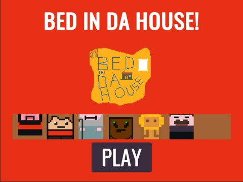
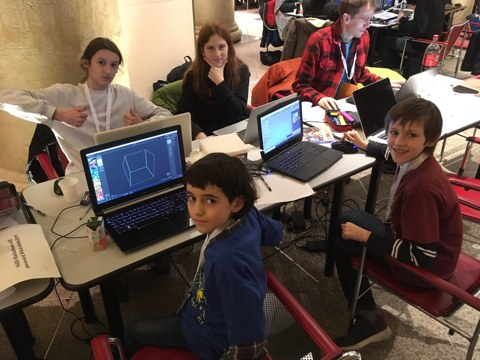

# Bed in da House

a game **designed and developed by kids and teens** at the [Global Game Jam 2019](https://globalgamejam.org/2019/games/bed-da-house), with the theme _"What home means to you"_

the team (from 10 to 14yo) worked in Rome, with the help of their parents/tutors.

They used open-source technologies ([Unity Playground](https://github.com/Unity-Technologies/UnityPlayground) and [Fungus framework](https://github.com/snozbot/fungus)), learning **tile maps** and drawing in [MagicaVoxel](http://ephtracy.github.io/), writing and acting the dialogues, playing the music and having lots of fun designing the levels, characters and puzzles.

see official page of the game here: <https://globalgamejam.org/2019/games/bed-da-house>

## PLAY
to play the game here from the browser, please
<https://jamurr.itch.io/bed-in-da-house>

## video trailer
to showcase the game at the Jam we recorded this short video <https://www.youtube.com/watch?v=s28Vm8gWLDg>

## Requirements
the game runs quite everywhere, it's a simple Unity 2018.3 project
The GitHub project is <https://github.com/JAMURR/JAM.BedInDaHouse>

## Team
Team 4+2 are
- Enea Polsinelli (kid)
- Fabio Cecere (kid)
- Maia Polsinelli (teen)
- Ruben Aicardi (teen)
- [Pietro Polsinelli](https://github.com/ppolsinelli/) (tutor)
- [Stefano Cecere](https://github.com/StefanoCecere/) (tutor)

## License
<http://creativecommons.org/licenses/by-nc-sa/4.0/>

## more informations
<https://jamurr.org>
